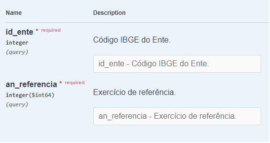

```{r setup, include=FALSE}
knitr::opts_chunk$set(echo = TRUE)
options(scipen=999)
```

### Como obter dados contábeis, orçamentários e fiscais dos entes da federação?

Leia o texto se você precisa de dados para:

1) sua publicação/dissertação/tese
2) acompanhar o orçamento do seu município
3) comparar o desempenho dos estados
4) identificar os gastos do tribunais de justiça
5) entender mais sobre finanças públicas

** acesse o vídeo explicativo https://www.youtube.com/user/4ndr3f3rr4r1/ **

### Acesse os dados abertos (API) do Tesouro Nacional para obter os dados

No segundo semestre de 2019 o Tesouro Nacional disponibilizou uma API (apidatalake.tesouro.gov.br/ords/siconfi/tt/) para facilitar o acesso aos seguintes dados da União, estados e municípios:

1) Extrato de relatórios homologados e matrizes entregues  
2) Relatório Resumido da Execução Orçamentária  
3) Relatório de Gestão Fiscal  
4) Declaração de Contas Anuais  
5) Matriz de Saldos Contábeis para contas patrimoniais, orçamentárias e de controle  
6) Anexos dos relatórios por esfera de governo  
7) Cadastro de entes da federação  


Nesse artigo apresento como obter dados contábeis, orçamentários e fiscais dos entes da federação.

As etapas para obter os dados são:  
0) anexar as libraries e criar funções  
1) baixar tabela com dados dos entes  
2) obter os extratos de relatórios e matrizes entregues  
3) utilizar os dados dos extratos para gerar as URLs utilizadas para acessar a API  
4) acessar a API, baixar os dados e apresentar a informação no formato de tabelas e/ou gráficos   
5) bônus: arquivo com todos os extratos


### 0) anexar as libraries e criar funções

Utilizei as libraries abaixo:

```{r message=FALSE, warning=FALSE}
library(dplyr)
library(data.table)
library(rjson)
library(stringr)
library(jsonlite)
library(httr)
library(purrr)
library(tidyverse)
library(readxl)
library(DT)
library(xlsx)
library(plotly)
```
***         


Criei a função json2df(). A função baixa o arquivo JSON e armazenar os dados em uma data frame.

A função foi inspirada no código do Marcos F Silva https://www.rpubs.com/marcosfs2006/api_siconfi.


```{r, json2df}

json2df = function(a){ 

# "a" é a URL
f_api <-   GET(a)

f_txt <- content(f_api, as="text", encoding="UTF-8")

f_json <- fromJSON(f_txt, flatten = FALSE)
Sys.sleep(1)

f_df <-as.data.frame(f_json[[1]]) 

}
```


Provavelmente você precisa acessar mais de um demonstrativo. Por exemplo:

1) o RGF e RREO de um determinado município
2) a DCA de todos os municípios catarinenses
3) as Matrizes de Saldos Contábeis para contas patrimoniais, orçamentárias e de controle

A função bind_json2df() agrupa os relatórios individuais em uma única data frame.


```{r, bind_json2df}
# função para juntar data frames

bind_json2df = function(a){ map(a,json2df)}
```

A função relatorios() acessa as urls, baixa os arquivos JSON, transforma os arquivos individuais em data frames, agrupa as data frames em uma única data frame. 


```{r, relatorios}

# funcao para gerar df com os dados dos relatórios
relatorios = function(a){map_dfr(bind_json2df(a), bind_rows)}

```
  
   

### 1) baixar tabela com dados dos entes


Utilizei a função json2df para criar uma data frame com os dados dos entes da federação.

```{r, entes}
# acessar url com dados dos entes

entes<- json2df("http://apidatalake.tesouro.gov.br/ords/siconfi/tt/entes")

datatable(entes)
```
  
      


### 2) obter os extratos de relatórios e matrizes entregues  

Para obter os extratos devemos informar o código IBGE e a ano referência.


 

Abaixo o resultado para o estado do Ceará.

```{r, exemplo extrato}

# apresentar exemplo da estrutura do extrato
asssembleia_ceara <- json2df( "http://apidatalake.tesouro.gov.br/ords/siconfi/tt/extrato_entregas?id_ente=23&an_referencia=2019")

datatable(asssembleia_ceara)

```
     


É importante ressaltar que os dados são de responsabilidade dos entes.

Os municípios devem encaminhar os demonstrativos para o Tesouro Nacional, que por sua vez, disponibiliza os dados na API.

De acordo com o Tesouro Nacional a base de dados apresenta alguns problemas. Destaco dois dos problemas:

1) incompleição: aproximadamente 5% dos municípios deixaram de encaminhar os demonstrativos.
2) impureza: alguns demonstrativos apresentam, por exemplo, saldos zerados. 

fonte: https://siconfi.tesouro.gov.br/siconfi/pages/public/conteudo/conteudo.jsf?id=22703  

   


#### 2.1) rotina para baixar extrato de vários entes

Fiz um loop com os códigos ibge da tabela ente (entes$cod_ibge) para acessar todos os extratos disponíveis.   

Precisei de quase duas horas para obter a tabela com todos os mais de 176 mil extratos.

O processamento foi interrompido algumas vezes por falha na conexão com a API. Tentei criar uma solução para reiniciar automaticamente o loop no caso de interrupção do processamento, mas optei por reiniciar o loop manualmente.

*Agradeço se alguém indicar como reiniciar automaticamente o loop!!!*

Neste exemplo, para acelerar o knit filtrei apenas três municípios catarinenses ("Florianópolis", "Blumenau", "Joinville").

```{r, loop para baixar extratos}
# arq para coletar todas as urls dos extratos de entregas
arq<- c()

# remover filtro para obter todos os extratos
entes_knit<-entes%>%filter(ente %in% c("Florianópolis","Blumenau","Joinville"))

# loop por todos os entes (cod_ibge) da tabela entes para acessar API, baixar arquivo e variável com todos as urls
for (i in entes_knit$cod_ibge){
  
files_json <- 
  str_replace("http://apidatalake.tesouro.gov.br/ords/siconfi/tt/extrato_entregas?id_ente=XXXXXX&an_referencia=2019","XXXXXX",toString(i))

arq<- c(arq, files_json)
}
# criar data frame com ente, cod_ibge e url
arq_ente<- data.frame ( "ente" =  entes_knit$ente, "cod_ibge" = entes_knit$cod_ibge, "url_extrato"=arq  )

  
# criar variáveis do loop
extratos <- c()
extratos_urls<-c()
status_api<- c()
status_cod_ibge<- c()

# loop em arq para baixar o extrato individual de cada ente
for (i in arq){
# acessa o API e baixa o arquivo JSON  
ext_api<-   GET(i)

ext_txt <- content(ext_api, as="text", encoding="UTF-8")

ext_json <- fromJSON(ext_txt, flatten = FALSE)

ext  <-as.data.frame(ext_json[["items"]]) 

# juntar os extratos
extratos<- rbind(ext, extratos)

# verificar status da consulta
status_api<- c(status_code(ext_api),status_api )

# verificar se acessou corretamente a API
status_cod_ibge<- c(status_cod_ibge, ext_json[["items"]][["cod_ibge"]] )
}

```
***   

Abaixo o chunk para identificar os extratos pendentes

```{r, verificar pendências}
# criar variável "entregue" com situação "pendente" ou "entregue"
arq_ente<- arq_ente%>%
  mutate (entregue = if_else((entes_knit$cod_ibge %in% (unique(extratos$cod_ibge)))== FALSE, "pendente", "entregue"))

arq_ente%>%
  group_by(entregue)%>%
  dplyr::summarise(quantidade = n ())
  
```
***      

Se for o caso, precisaremos reiniciar manualmente o loop para baixar os arquivos pendentes.
Desnecessário neste exemplo, pois conseguimos baixar os extratos dos três municípios ("Florianópolis","Blumenau","Joinville").

```{r echo=TRUE}

#filtrar apenas extratos pendentes
arq_ente_pendente <- arq_ente%>%
  filter (entregue == "pendente")


# loop em rq_ente_pendente para baixar os extratos pendente
for (i in arq_ente_pendente$url_extrato){
# acessa o API e baixa o arquivo JSON  
ext_api<-   GET(i)


ext_txt <- content(ext_api, as="text", encoding="UTF-8")

ext_json <- fromJSON(ext_txt, flatten = FALSE)


ext <-as.data.frame(ext_json[["items"]]) 

extratos<- rbind(ext, extratos)

status_api<- c(status_code(ext_api),status_api )

status_cod_ibge<- c(status_cod_ibge, ext_json[["items"]][["cod_ibge"]] )


}

arq_ente%>%
  group_by(entregue)%>%
  dplyr::summarise(quantidade = n ())


```
***   


### 3) utilizar os dados dos extratos para gerar as URLs utilizadas para acessar a API

Para obter o RGF precisamos informar, dentre outros, os itens abaixo:  
1) tipo do demonstrativo (RGF ou RGF Simplificado)   
2) código do poder (E = Executivo, L = Legislativo, J = Judiciário, M = Ministério Público, D = Defensoria Pública)

Contudo o tipo do demonstrativo e código do poder estão ausentes da tabela extratos. No chunk abaixo adicionamos à tabela extratos o tipo do demonstrativo e código do poder além de outras variáveis (http://apidatalake.tesouro.gov.br/docs/siconfi/#/RGF/get_rgf).   


#### 3.1) criar nova variáveis para facilitar a criação das urls e construção de futuros filtros.

```{r, adicionar variáveis à df extrato (tipo, poder, uf, ente, regiao, esfera, capital))}


# tornar amigavel a df extratos
extratos<- extratos%>%
  mutate (data = as.Date (data_status))

# adicionar variável "tipo" (nome reduzido do entregavel) 
extratos<- extratos%>%
  mutate (tipo =case_when(
 entregavel == "Balanço Anual (DCA)" ~ "DCA", 
 entregavel == "MSC Agregada" ~ "MSCC",
 entregavel == "MSC Encerramento" ~ "MSCE",
 entregavel == "Relatório de Gestão Fiscal" ~ "RGF",
 entregavel == "Relatório de Gestão Fiscal Simplificado" ~ "RGF Simplificado",
 entregavel == "Relatório Resumido de Execução Orçamentária" ~ "RREO",
 entregavel == "Relatório Resumido de Execução Orçamentária Simplificado" ~ "RREO Simplificado"
))


# adicionar variável "poder" (L/legislativo, E/executivo, J/Judiciário...)
extratos<-extratos%>%
  mutate (poder = case_when(
    str_detect(instituicao,'Assembleia Legislativa') ~ "L",
    str_detect(instituicao,'Câmara de Vereadores') ~ "L",
    str_detect(instituicao,'Senado Federal') ~ "L",
    str_detect(instituicao,'Câmara dos Deputados') ~ "L",
    str_detect(instituicao,'Câmara Legislativa') ~ "L",
    str_detect(instituicao,'Prefeitura Municipal') ~ "E",
    str_detect(instituicao,'Governo do') ~ "E",
    str_detect(instituicao,'Governo Federal') ~ "E",
    str_detect(instituicao,'Tribunal') ~ "J",
    str_detect(instituicao,'Conselho da Justiça Federal') ~ "J",
    str_detect(instituicao,'Conselho Nacional de Justiça') ~ "J",
    str_detect(instituicao,'Ministério Público') ~ "M",
    str_detect(instituicao,'Defensoria') ~ "D",
    str_detect(instituicao,'CONSÓRCIO') ~ "C",
    str_detect(instituicao,'CONSORCIO') ~ "C",
    str_detect(instituicao,'Consórcio') ~ "C",
    TRUE ~ "O"
  ))

# mesclar df entes e extratos para carregar na df extratos as variáveis (uf, ente, regiao, esfera, capital)
entes_merge<-entes%>%
  select( ente, uf, regiao, esfera, capital, cod_ibge)

extratos<- merge(extratos, entes_merge, by = "cod_ibge")

# cria variável ente_uf para diferenciar cidades com mesmo nome
extratos<-extratos%>%
  mutate(ente_uf = paste0(ente,"-",uf))
```
***      

#### 3.2) dividir a data frame extratos em duas: 

As Matizes têm uma estrutura diferente dos demais demonstrativos (RREO, RGF e DCA). Por esse motivo, optei por desmembrar a data frame extratos em duas: extratos_msc e extratos_relatorios.  


##### 3.2.1) *extratos_msc* para a MSCC mais recente

Os entes devem encaminhar 12 matrizes por ano (uma por mês). Cada matriz pode ter os valores detalhados por classe contábil e tipo de saldos saldo incial (beginning_balance), saldo final (ending_balance) ou movimento (period_change).

Optei por obter o saldo final (ending_balance) de todas as classes contábeis (ativo, passivo...) da matriz mais recente (max(periodo)).

```{r, extratos para Matrizes}

# criar df extratos_msc com as variáveis (ente,tipo, cod_ibge, regiao, uf, esfera, poder, exercicio,populacao)
# selecionar apenas MSCC
extratos_msc<-extratos%>%
  filter(tipo %in% c("MSCC"))%>%
  group_by(ente,tipo, cod_ibge, regiao, uf, esfera, poder, exercicio,populacao, ente_uf)%>%
  # max(periodo) para capturar apenas a matriz mais recente
  summarise(recente = max(periodo))

# criar link para API
extratos_msc<-extratos_msc%>%
  mutate(classe_1 = paste0("http://apidatalake.tesouro.gov.br/ords/siconfi/tt/msc_patrimonial?id_ente=",cod_ibge,"&an_referencia=",exercicio,"&me_referencia=",recente,"&co_tipo_matriz=MSCC&classe_conta=1&id_tv=ending_balance") )%>%
  mutate(classe_2 = paste0("http://apidatalake.tesouro.gov.br/ords/siconfi/tt/msc_patrimonial?id_ente=",cod_ibge,"&an_referencia=",exercicio,"&me_referencia=",recente,"&co_tipo_matriz=MSCC&classe_conta=2&id_tv=ending_balance" ))%>%
  mutate(classe_3 = paste0("http://apidatalake.tesouro.gov.br/ords/siconfi/tt/msc_patrimonial?id_ente=",cod_ibge,"&an_referencia=",exercicio,"&me_referencia=",recente,"&co_tipo_matriz=MSCC&classe_conta=3&id_tv=ending_balance") )%>%
  mutate(classe_4 = paste0("http://apidatalake.tesouro.gov.br/ords/siconfi/tt/msc_patrimonial?id_ente=",cod_ibge,"&an_referencia=",exercicio,"&me_referencia=",recente,"&co_tipo_matriz=MSCC&classe_conta=4&id_tv=ending_balance" ))%>%
  mutate(classe_5 = paste0("http://apidatalake.tesouro.gov.br/ords/siconfi/tt/msc_orcamentaria?id_ente=",cod_ibge,"&an_referencia=",exercicio,"&me_referencia=",recente,"&co_tipo_matriz=MSCC&classe_conta=5&id_tv=ending_balance" ))%>%
  mutate(classe_6 = paste0("http://apidatalake.tesouro.gov.br/ords/siconfi/tt/msc_orcamentaria?id_ente=",cod_ibge,"&an_referencia=",exercicio,"&me_referencia=",recente,"&co_tipo_matriz=MSCC&classe_conta=6&id_tv=ending_balance" ))%>%
  mutate(classe_7 = paste0("http://apidatalake.tesouro.gov.br/ords/siconfi/tt/msc_controle?id_ente=",cod_ibge,"&an_referencia=",exercicio,"&me_referencia=",recente,"&co_tipo_matriz=MSCC&classe_conta=7&id_tv=ending_balance" ))%>%
  mutate(classe_8 = paste0("http://apidatalake.tesouro.gov.br/ords/siconfi/tt/msc_controle?id_ente=",cod_ibge,"&an_referencia=",exercicio,"&me_referencia=",recente,"&co_tipo_matriz=MSCC&classe_conta=8&id_tv=ending_balance" ))

```
***         


##### 3.2.2) *extratos_relatorios* para RREO, RGF e DCA.

Agrupei em uma única data frame o RREO, RGF e DCA. 


```{r, extratos_relatorios}
# criar df extratos_relatorios (excluir MSCC e MSCE)
extratos_relatorios<-extratos%>%
  filter(tipo != ("MSCC"),tipo != ("MSCE") )

# criar link para API
extratos_relatorios<-extratos_relatorios%>%
 mutate (url_api =case_when(
 tipo == "DCA" ~ paste0("http://apidatalake.tesouro.gov.br/ords/siconfi/tt/dca?an_exercicio=",exercicio,"&id_ente=",cod_ibge), 
 tipo == "MSCA" ~ "MSCA",
 tipo == "MSCE" ~ "MSCE",
 tipo == "RGF" ~ paste0("http://apidatalake.tesouro.gov.br/ords/siconfi/tt/rgf?an_exercicio=",exercicio,"&in_periodicidade=",periodicidade,"&nr_periodo=",periodo,"&co_tipo_demonstrativo=RGF&co_poder=",poder,"&id_ente=",cod_ibge),
 tipo == "RGF Simplificado" ~ paste0("http://apidatalake.tesouro.gov.br/ords/siconfi/tt/rgf?an_exercicio=",exercicio,"&in_periodicidade=",periodicidade,"&nr_periodo=",periodo,"&co_tipo_demonstrativo=RGF%20Simplificado&co_poder=",poder,"&id_ente=",cod_ibge),
 tipo == "RREO" ~ paste0("http://apidatalake.tesouro.gov.br/ords/siconfi/tt/rreo?an_exercicio=",exercicio,"&nr_periodo=",periodo,"&co_tipo_demonstrativo=RREO&id_ente=",cod_ibge),
 tipo == "RREO Simplificado" ~ paste0("http://apidatalake.tesouro.gov.br/ords/siconfi/tt/rreo?an_exercicio=",exercicio,"&nr_periodo=",periodo,"&co_tipo_demonstrativo=RREO%20Simplificado&id_ente=",cod_ibge)
 
) )

```
***         


### 4) acessar a API, baixar os dados e apresentar a informação no formato de tabelas e/ou gráficos  

Uma vez que as tabelas MSCC e RGF têm formatos diferentes, vamos acessar inicialmente a RGF do segundo quadrimestre de 2019 das câmaras municipais de Blumenau, Florianópolis e Joinville. Em seguida, baixaremos a MSCC do município de Florianópolis.  

#### 4.1) RGF

A RGF pode ser detalhada por tipo de poder. No exemplo abaixo selecionei o poder legislativo.


```{r warning=FALSE}
# selecionar o RGF (tipo == "RGF") do segundo quadrimenestre (periodo ==2) das câmaras municipais (poder == "L")
rgf_url<-extratos_relatorios%>%
  filter(  tipo == "RGF", poder =="L", periodo == 2)

# obter a RGF a partir da URL
rgf <-relatorios(rgf_url$url_api)

# filtrar apenas a despesa total com pessoal nos últimos 12 meses
rgf_pessoal<-rgf%>%
  filter ( coluna == "TOTAL (ÚLTIMOS 12 MESES) (a)",
           cod_conta == "DespesaComPessoalLiquida")%>%
  mutate(despesa = valor/1000000)%>%
  arrange(despesa)


# preparar df merge_mun que será mesclada à df rgf_pessoal
# o objetivo é agregar à df rgf_pessoal as variáveis: regiao, ente_uf, instituicao e ente.
merge_mun<-extratos%>%
  filter(tipo == "RGF", periodo == 2, esfera == "M")%>%
  select(regiao, ente_uf, instituicao, ente)
  
rgf_pessoal<- merge(rgf_pessoal, merge_mun, by = "instituicao")

# plotar o gráfico
 gasto<- ggplot()+
    geom_col(data = rgf_pessoal, aes( x=reorder (instituicao, despesa), y=despesa, fill= instituicao))+
   coord_flip()
 gasto <-ggplotly(gasto) %>%
  layout(showlegend = FALSE)%>%
  layout( title = "Despesa com pessoal entre set/2018 e ago/2019 (R$ milhões)",
          xaxis = list( title = "", showline = FALSE, showgrid = FALSE),
          yaxis = list ( title = "", showline = FALSE, showgrid = FALSE ))
  
(gasto)
  
 datatable(rgf_pessoal%>%
             select(instituicao, valor))
 
```
  
  
#### 4.2) Matriz de Saldos Contábeis de Florianópolis

A MSCC traz os dados do ente. Não é possível parametrizar a consulta por tipo de poder.


```{r warning=FALSE}

# filtrar apenas Florianópolis
msc_fln_url<-extratos_msc%>%
  filter( cod_ibge == 4205407)

# criar df com a url do api de cada classe contábil (colunas 12 a 19 da df com os extratos das MSC)
classes_fln<- map_dfr(msc_fln_url[12:19], cbind.data.frame)

# renomear 
names(classes_fln)[1] <- "url_api"

# aplicar a função
msc_fln<-relatorios((classes_fln$url_api))

# filtrar classe contábil 3 e agragar por conta contábil e natureza da conta (Débito ou Crédito)
msc_fln_classe_3<-msc_fln%>%filter(classe_conta == 3)%>%
  group_by( conta_contabil, natureza_conta)%>%
  summarise(saldo = (sum(valor)))

datatable(msc_fln_classe_3)
```


#### 5) Bônus: arquivo com todos os extratos

```{r}
# base de dados de 08 fevereiro 2020

extratos <- read_excel("extratos2.xlsx")

extratos%>%
  group_by(entregavel)%>%
  dplyr::summarise(quantidade = n ())
```


##### Referências bacanas

função para transformar json em data frame: https://www.rpubs.com/marcosfs2006/api_siconfi

dica de encoding: http://www.leg.ufpr.br/~walmes/ensino/ce083-2014-02/ce083-2014-02-aula10.html